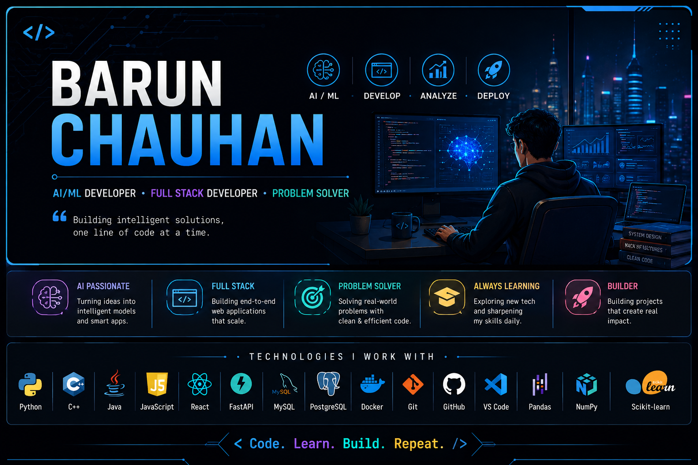

<p align="center">
  
</p>

# 👋 Hi, I'm Barun Chauhan

<p align="center">


</p>

<p align="center">
  <b>AI/ML Developer • Full Stack Developer • Problem Solver</b>
</p>

<p align="center">
  <a href="https://github.com/Barun5278">
    
  </a>
  <a href="https://www.linkedin.com/in/barun-chauhan2/">
    
  </a>
</p>

---

## 🧑‍💻 About Me

I'm a Computer Science and Engineering student specializing in AI/ML, passionate about building intelligent, practical and scalable software solutions.

* 🎓 B.Tech CSE (AI/ML) student at Lovely Professional University
* 🤖 Interested in Artificial Intelligence, Machine Learning and Agentic AI
* 💻 Building full-stack applications with modern technologies
* 🧠 Solved 120+ Data Structures & Algorithms problems
* 🚀 Currently building **AI-Spend-Analysis**
* 🔍 Interested in real-world AI applications and intelligent automation
* 📚 Always learning and experimenting with new technologies

---

## 🛠️ Tech Stack

### 💻 Languages


### 🤖 AI / Machine Learning


### 🌐 Full Stack


### 🗄️ Databases


### 🔧 Tools


---

## 🚀 Featured Projects

<table>
<tr>

<td width="50%" valign="top">

### 💰 AI-Spend-Analysis

**AI-powered personal finance platform**

A production-grade full-stack application that analyzes spending patterns and generates intelligent financial insights using Machine Learning and LLMs.

**Tech Stack**


<br>

**🔗 [View Repository →](https://github.com/Barun5278/AI-SPEND-ANALYSIS)**

</td>

<td width="50%" valign="top">

### 🛡️ FraudGuard

**Real-time financial fraud detection**

Machine learning application that detects potentially fraudulent financial transactions and serves predictions through a web interface.

**Tech Stack**


<br>

**🔗 [View Repository →](https://github.com/Barun5278/FraudGuard)**

</td>

</tr>

<tr>

<td width="50%" valign="top">

### 👟 Sneakers E-Commerce

**Responsive e-commerce website**

A fully responsive sneakers shopping experience with dynamic interactions, optimized navigation and a clean user-focused interface.

**Tech Stack**


<br>

**🔗 Repository:** `Add your GitHub link`

</td>

<td width="50%" valign="top">

### 🧠 More Projects

I'm continuously building and experimenting with:

* 🤖 Artificial Intelligence
* 🧠 Machine Learning
* 🌐 Full-Stack Applications
* 🔗 LLM-powered systems
* ⚡ Intelligent automation

**More projects coming soon...**

</td>

</tr>
</table>


## 🧠 DSA & Problem Solving

<p align="center">
  
  
</p>

Currently strengthening my foundations in:

* Data Structures
* Algorithms
* Problem Solving
* Complexity Analysis
* Competitive Programming

---

## 🎯 Currently Building

```text
AI / ML
   ↓
Intelligent Applications
   ↓
Full-Stack Development
   ↓
Scalable Backend Systems
   ↓
Real-World Products
```

### Current Focus

* 🤖 AI-powered applications
* 💰 AI-Spend-Analysis
* 🧠 Machine Learning
* 🔗 LLM-powered systems
* 🌐 Full-stack development
* 🐳 Docker & backend engineering
* 🧩 Data Structures & Algorithms

---

## 🎓 Education

**Bachelor of Technology — Computer Science & Engineering (AI/ML)**
Lovely Professional University
2024 — 2028

**Current CGPA: 8.96 / 10**

---

## 🏆 Achievements

* 🧠 Solved **120+ DSA problems** from Striver's A2Z Sheet on LeetCode
* 🚀 Built **3 independent technical projects** across AI/ML, full-stack development and fraud detection
* 🎓 Maintained a **8.96 CGPA** in B.Tech CSE (AI/ML)
* ⭐ Completed a **6-week live Artificial Intelligence internship** with A+ overall performance
* 🤖 Earned **Oracle Foundations Associate — Agentic AI** certification

---

## 📊 GitHub Stats

<p align="center">


</p>

---

## 🔥 GitHub Streak

<p align="center">


</p>

---

## 📈 Contribution Graph

<p align="center">


</p>

---

## 🌐 Let's Connect

<p align="center">

<a href="https://github.com/Barun5278">

</a>

<a href="https://www.linkedin.com/in/barun-chauhan2/">

</a>

</p>

<p align="center">

<b>💡 Building. Learning. Solving. Repeating.</b>

</p>
